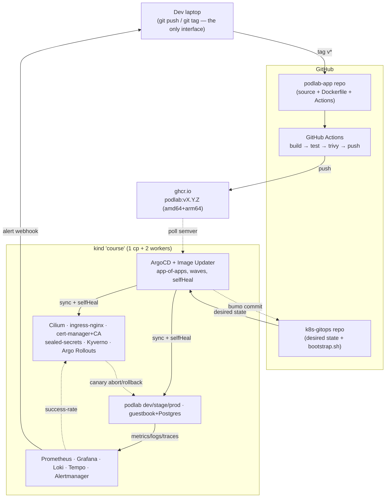

# Day 50 — Capstone III: Portfolio, Narrative, Interview, Cert

> **Time:** ~4 h · **Builds on:** Days 48, 49 (and all 49 before them)

## Objectives

- Turn `k8s-gitops` into a public portfolio repo with an architecture diagram and a 90-second narrative
- Internalize substantial model answers — with receipts from your own platform — for the 10 questions you will actually be asked
- Map the course to CKA domains, run a 25-minute timed mock, and know your honest gaps
- Leave with a concrete 2-week plan: cert, cloud migration outline, or write-up

## Concepts

Fifty days ago you ran `kind create cluster`. Today you own a platform that builds, scans, deploys, canaries, observes, heals, and rebuilds itself — and the difference between *having done that* and *getting hired for it* is packaging: a diagram someone groks in 30 seconds, a repo that reads well in the 4 minutes a reviewer gives it, and answers that lead with architecture and end with evidence. That's today's work. No new cluster mechanics — this lesson is a kit, and it's deliberately longer on reference material than on lab steps.

One principle for everything below: **claims with receipts**. "We had canary deploys" is a claim. "Here's the AnalysisRun from the release my platform auto-rolled-back, and the alert it fired" is a receipt. Your repo is full of receipts now; the work is surfacing them.

## Lab

### 1. The architecture diagram

A complete Mermaid source is in [`architecture.mmd`](architecture.mmd) — every component, and more importantly the **three control loops drawn as loops** (image-updater write-back, ArgoCD selfHeal, analysis→rollback), because control loops are what make this a *platform* rather than a pile of installed charts.



(The compact version above is for READMEs; the full `architecture.mmd` is the interview/screen-share version.) **Customize it**: your GitHub username, anything you added (CNPG? Velero as an app?) or skipped. Then practice the **5-minute walk**, in this order — it mirrors how you'd debug it, and interviewers notice that:

1. *Ship path* (left to right): tag → CI → registry → bump commit → sync → canary. 30 seconds.
2. *The three control loops*: who watches what, who writes what. This is where you sound senior.
3. *Runtime guardrails*: admission (Kyverno), secrets (sealed), TLS (CA), network (Cilium policies).
4. *Observability*: every workload emits metrics/logs/traces; alerts close the loop back to a human.
5. *The kill shot*: "and the whole right side rebuilds from the repo in ~25 minutes — I've done it."

Say it out loud, timed, twice. It gets dramatically better between attempt one and two.

### 2. Make the repo public-ready

The portfolio checklist for `~/Code/k8s-gitops`:

- [ ] **README.md** with: the diagram (GitHub renders ` ```mermaid ` fences natively), a 90-second "what is this" paragraph (what it runs, what's automated, the one-command rebuild claim), and links to `BOOTSTRAP.md` (Day 48), `demo-script.md` + AAR (Day 49). Skeleton:

```markdown
# k8s-gitops — a self-rebuilding Kubernetes platform

One repo, one script, one key file → a complete platform: GitOps (ArgoCD app-of-apps),
canary deploys gated on live Prometheus analysis with automatic rollback, encrypted
secrets in git, policy-as-code admission control, full metrics/logs/traces, and TLS
from an in-repo CA. CI builds images; a bot commits version bumps; humans only push git.

[architecture diagram — mermaid fence here]

- **Rebuild from nothing:** [`BOOTSTRAP.md`](BOOTSTRAP.md) — ~25 min, rehearsed
- **Release demo + after-action report:** [`demo-script.md`](demo-script.md)
- **Highlights:** auto-rollback of a bad canary (AnalysisRun evidence inside),
  sealed-secrets DR with key restore, Kyverno guardrails, multi-env via Kustomize+ApplicationSet
```
- [ ] **Secrets audit** — the one that can hurt you. Verify nothing sensitive ever entered history, not just the working tree:

```sh
cd ~/Code/k8s-gitops
git log --all -p | grep -ciE "sealed-secrets-key|BEGIN (RSA |EC )?PRIVATE KEY"   # MUST be 0
git log --all -p | grep -ciE "password.*=|token.*ghp_|secret.*:.*[A-Za-z0-9+/]{20,}" # review every hit
git log --all --diff-filter=A --name-only | sort -u | grep -iE "key|secret|\.env" # suspicious filenames ever added
```

`SealedSecret` resources are fine — that's their whole point. The private key backup, raw `Secret` manifests with real values, PATs in scripts: those are not. A hit in history means `git filter-repo` or a fresh repo — annoying, but better found by you than by a scraper bot (which will find a leaked key within minutes of going public).

- [ ] **.gitignore** covers `*key-backup*`, `*.pem`, `.env*`, local scratch dirs
- [ ] Skim for embarrassments: TODOs, hardcoded `/Users/you/` paths in scripts (parameterize like `bootstrap.sh` does), dead experiments → delete or move to a `scratch/` branch
- [ ] Then: `gh repo edit --visibility public` (or keep private and grant access on request — also fine; the *readiness* is the deliverable)

### 3. Talking points — the 10 questions, with model answers

Read each, then rewrite it in your own words with **your** specifics. The structure to copy: architecture first, the why second, evidence third, honest limits last.

**Q1 — "Walk me through commit to production."**

> A developer's interface is git: merge to the app repo, push a semver tag. GitHub Actions builds a multi-arch image, runs tests and a Trivy scan that blocks critical CVEs, and pushes to ghcr — CI ends at the registry and holds no cluster credentials. ArgoCD Image Updater spots the new tag and commits the version bump to our gitops repo, so every deploy is a git commit with author, diff, and timestamp. ArgoCD reconciles the cluster to that commit; for the prod app that triggers an Argo Rollouts canary — 20% of traffic, then an automated Prometheus analysis on success rate, then 50%, then 100%. If analysis fails, it auto-rolls-back and alerts; nothing degrades beyond the canary slice. Rollback at any layer is `git revert`. I've run this end-to-end with zero kubectl commands between tag and serving traffic — that separation is the design, not an accident.

*Expect the follow-up:* "what if CI is compromised?" → worst case it pushes a bad image or a bad bump commit — both visible in git/registry history, both revertible; it cannot touch the cluster.

**Q2 — "How do you handle secrets in GitOps?"**

> The repo must be safe to leak, so plaintext secrets never enter it. We use Sealed Secrets: developers encrypt with the controller's public key via kubeseal, commit the SealedSecret, and only the in-cluster controller can decrypt it into a real Secret. That keeps the GitOps property — secrets are versioned, reviewed, and deployed like everything else. The critical operational detail is the private key: it's the one artifact that must live *outside* git, backed up offline, because disaster recovery depends on restoring it *before* the controller starts — otherwise every ciphertext in the repo is garbage. I've rehearsed exactly that during a full cluster rebuild. Honest tradeoffs: sealing is per-cluster, rotation needs re-sealing, and there's no central audit of *reads* — at company scale I'd weigh External Secrets Operator backed by Vault or a cloud secret manager, which we also evaluated.

*Expect the follow-up:* "how do you rotate a secret?" → change the source value, re-seal, commit; the controller updates the Secret and the workload picks it up on remount/restart — and that's a git-auditable event.

**Q3 — "Canary vs blue-green — and when?"**

> Blue-green runs the full new version alongside the old and cuts all traffic at once: simple mental model, instant rollback, easy pre-cutover smoke testing on the preview service — but it needs double capacity, and the cutover is all-or-nothing, so 100% of users meet a bad release simultaneously. Canary shifts a small slice — we do 20% — and, crucially, gates promotion on *measured* health: our Rollouts run a Prometheus analysis on success rate before each step, so a bad release is caught while 80% of users never saw it, and rollback is automatic. Cost: more moving parts, and you need version-aware metrics and enough traffic for the statistics to mean something. My defaults: canary with automated analysis for user-facing services with real traffic volume; blue-green for low-traffic services, big-bang schema-coupled releases, or where compliance wants an explicit human cutover. Both come almost free once Rollouts is installed.

*Expect the follow-up:* "what about database migrations during a canary?" → both versions run simultaneously, so schema changes must be backward-compatible (expand-migrate-contract); that constraint exists regardless of deploy strategy, canary just makes it visible.

**Q4 — "A node dies. What happens? Trace the controllers."**

> The kubelet stops heartbeating to the API server. The node-lifecycle controller marks the node `NotReady` after the grace period (~40s), and after the eviction timeout (~5 min by default) taints it so its pods get deletion timestamps. The pods' owning controllers react: ReplicaSets see replica count short and create replacements; the scheduler binds them to surviving nodes; kubelets there pull images and start containers. Endpoints controllers had already dropped the dead pods from Service endpoints once they failed readiness, so traffic stopped flowing well before the replacements — that gap is why replicas plus pod anti-affinity matter. Stateful pods are trickier: a StatefulSet won't replace a pod until the old one is confirmed gone, and local storage dies with the node — our operator-managed Postgres handles that by promoting a streaming replica in seconds instead. Each step is the same pattern: a controller observing actual vs desired and converging. Nobody orchestrates it; that's the point.

*Expect the follow-up:* "how do you make that faster / less disruptive?" → readiness probes that actually reflect health, anti-affinity so one node ≠ one app, PDBs for the *voluntary* case, and tuned tolerations for the eviction timeout where 5 minutes is too slow.

**Q5 — "The app is slow. Debug it."**

> I start at metrics, because they tell me *where* without guessing. The RED dashboard: is it all endpoints or one, all pods or one, is the error rate up too, and when did p95 deflect — correlate that timestamp with deploys, our git log makes that trivial. Resource pressure next: throttling from CPU limits and OOM restarts are the boring answers that are usually right. If metrics localize it to a service, traces tell me *what inside it*: in Tempo, find slow traces and read the span waterfall — is the time in the handler, a downstream call, the database? Logs come last and targeted: with trace-to-logs correlation I jump from the slow trace straight to that request's log lines rather than grepping everything. If it's the database, it's usually one query or a missing index — back to its metrics. The discipline is metrics → traces → logs: aggregate first, narrow, never start by tailing logs on a hunch.

*Expect the follow-up:* "and if the dashboards themselves are down?" → kubectl top, node conditions, events — the platform's own health is monitored by the same stack, which is why alerting on Prometheus's own targets matters.

**Q6 — "Three environments, consistent yet different — how?"**

> One Kustomize base holds everything true everywhere: the workload shape, probes, security context, labels. Each env is an overlay patching only what genuinely differs — replicas, resources, hostnames, image tag, env-specific config. The diff between prod and dev *is* readable in git, which is the real win: no copy-paste manifests drifting apart silently. An ArgoCD ApplicationSet generates the three Applications from the overlay directories, so adding an environment is adding a directory, not clicking anything. Promotion is moving a tag value from one overlay to the next — a reviewable commit. Guardrails apply uniformly because Kyverno policies are cluster-wide, not per-env YAML. Where I'd evolve it: at many-team scale the same pattern holds across *clusters* — same base, per-cluster overlays, ApplicationSets with cluster generators — and config that's secret or truly dynamic moves out of overlays into sealed secrets or external config.

*Expect the follow-up:* "how do you stop prod-only patches from accumulating?" → the diff between overlays is reviewable in every PR; keep a norm that anything appearing in the prod overlay twice gets promoted to the base.

**Q7 — "Tell me your cluster disaster-recovery story."**

> We treat the cluster as disposable and rehearse that. Desired state lives in a gitops repo; a bootstrap script rebuilds from zero: create cluster, install the CNI, restore the sealed-secrets private key from offline backup *before* the controller starts — the ordering that keeps every encrypted secret in git valid — seed ArgoCD, apply one root Application. Sync waves rebuild the platform in dependency order; the whole thing converges in about 25 minutes, and I know because I've destroyed and rebuilt it, then fixed every gap I found *in git* and logged it in a runbook. Data is deliberately not GitOps's job: databases come back from backups — we proved that with Velero — so platform recovery and data recovery are separate, independently tested paths. Remaining honest risks: the key backup is a single point of failure with a documented re-seal fallback, and backups stored inside the cluster's own object store don't survive the cluster — real DR puts them outside.

*Expect the follow-up:* "what's your RTO/RPO?" → platform RTO ~30 min (measured, not estimated); data RPO = backup schedule, e.g. nightly Velero + WAL archiving if the database needs minutes-not-hours.

**Q8 — "How do you right-size resource requests?"**

> Measure, don't guess. Requests drive scheduling and bin-packing, so systematic over-requesting wastes most of a cluster and under-requesting causes noisy-neighbor latency and evictions — your QoS class is literally the kill order under node pressure. We run the VPA recommender in recommendation-only mode with Goldilocks as the dashboard: it builds usage histograms per container under real traffic and proposes requests; I compare against current settings and adjust via git like any other change. Recommender-only is deliberate — auto-apply restarts pods and fights HPA on the same resource. Limits I treat differently: memory limits yes, because OOM is at least crisp; CPU limits often skipped or set generously, since throttling is the silent latency killer. Then it's a loop, not a one-off — re-check after traffic or code changes, with cluster-level capacity reviewed via tools like kubectl resource-capacity.

*Expect the follow-up:* "VPA and HPA together?" → not on the same metric: HPA scales replicas on CPU while VPA rewrites CPU requests = feedback loop; use VPA recommendations to set the baseline, HPA to handle load.

**Q9 — "How do you enforce standards across teams?"**

> At admission, with policy-as-code — not in a wiki. Kyverno policies in our gitops repo: validation rejects what's non-negotiable (no `:latest` tags, required ownership labels), mutation makes the right thing automatic (default resource requests injected when omitted), and generation stamps baseline objects into every new namespace — we generate a default-deny NetworkPolicy so isolation is opt-out, not opt-in. The policies are versioned and reviewed like code, and new rules start in `Audit` mode so you measure violations before you break anyone's deploys — that rollout discipline matters more than the tool. Admission is the last line; the same checks run earlier where feedback is cheaper: linting and scanning in CI. Layered with Pod Security Standards on namespaces and RBAC, the effect is that the paved road is enforced by machinery, and exceptions are explicit, reviewable policy changes — not tribal knowledge.

*Expect the follow-up:* "doesn't that slow teams down?" → the opposite when done right: mutation + generation mean teams ship *less* YAML, and Audit-first rollout means policies never surprise anyone in a deploy.

**Q10 — "What changes at 100× scale?"**

> Honest answer: the architecture survives, the substrate doesn't. kind becomes EKS/GKE — managed control plane, real storage classes, cloud load balancers, IRSA-style identity instead of static credentials. One cluster becomes many — per region or per tier — and GitOps is what makes that tractable: ApplicationSets with cluster generators deploy the same stack everywhere, possibly with a hub-and-spoke ArgoCD. Karpenter or autoscaling replaces my fixed two workers. Observability federates: per-cluster Prometheus with Thanos or Mimir for global view, and cardinality becomes a real budget. Sealed-secrets likely yields to External Secrets + Vault for central rotation and audit. A mesh — *maybe* — if mTLS-everywhere or cross-service traffic policy is actually required; I'd resist it until the requirement is concrete. And the biggest change is organizational: the platform becomes a product with on-call, SLOs, upgrade trains, and tenancy boundaries — the control loops stay the same, which is exactly why they're worth learning on a laptop.

*Expect the follow-up:* "what would you keep exactly as-is?" → the gitops core: app-of-apps, sealed/external secrets, canary analysis, policy at admission. Those patterns are scale-invariant — that's the claim the whole answer rests on.

### 4. Practice run — and the resume lines

Pick three questions cold (dice, or a friend picks), answer out loud against a timer at ~90 seconds each, screen-sharing the diagram or repo where it helps. You know the material; this step trains retrieval under mild pressure, which is the actual skill interviews test.

While it's fresh, also distill the resume bullets — claims with receipts, quantified, no tool-soup:

> - Built and operate a GitOps platform (ArgoCD app-of-apps) deploying 3 environments from one repo; full cluster rebuild from git in ~25 minutes, rehearsed and runbook'd
> - Implemented commit-to-production automation: tagged release → CI (multi-arch build, CVE gate) → automated canary with Prometheus-based analysis and auto-rollback — zero manual deploy steps
> - Designed failure containment proven live: bad release detected at 20% traffic and rolled back automatically in under 2 minutes, with alerting and after-action reporting
> - Enforced org standards as code: admission policies (Kyverno), encrypted secrets in git (Sealed Secrets) with rehearsed key-restore DR, TLS from managed CA

Adapt the numbers to *your* measured ones — that's the difference between these bullets and everyone else's.

## CKA corner 🎓 — the finale

### Course → exam domain map

CKA domains, current weights, and where this course covered them:

| Domain (weight) | Covered by | Coverage |
|---|---|---|
| Troubleshooting (30%) | Days 2, 10, 17, 35, 44, 47 — the two gauntlets are exam-shaped | ~85% |
| Cluster Architecture, Installation & Configuration (25%) | Days 1, 14, 16, 24–28, 46, 47, 48 (RBAC, etcd backup, upgrades-on-paper, extension interfaces, Helm/Kustomize) | ~70% — kubeadm on real VMs is the gap |
| Services & Networking (20%) | Days 4, 5, 15, 40 (Services, Ingress, Gateway-adjacent, CoreDNS, NetworkPolicies with Cilium) | ~85% |
| Workloads & Scheduling (15%) | Days 2, 3, 6–8, 12, 13, 18, 47 (deployments, rollouts, config, scheduling, PDB, priority) | ~90% |
| Storage (10%) | Days 11, 16, 43 (PV/PVC/SC, binding, expansion) | ~75% — storage class variety is thin on kind |

Exam logistics in brief: ~2 hours, ~17 hands-on tasks on remote terminals, one allowed tab on `kubernetes.io/docs`, score 66% to pass, one free retake. Speed habits that pay: `--dry-run=client -o yaml` to scaffold everything, `kubectl explain --recursive` instead of doc-hunting field names, **always check your context/namespace first** (every task tells you which), and skip-and-return on anything over ~7 minutes. The 20-second setup to type the moment the terminal opens:

```sh
alias k=kubectl
export do="--dry-run=client -o yaml"     # usage: k run web --image=nginx $do > pod.yaml
export now="--grace-period=0 --force"    # fast pod deletes between tasks
# exam terminals usually pre-set these; verify rather than assume
```

### The 25-minute mock — 10 drills, timed

Set a timer. All on your course cluster; per-drill targets in brackets. No peeking until the timer ends.

1. **[2 min]** Save the names of all pods in `monitoring` sorted by creation time, oldest first, to `/tmp/pods.txt` — kubectl only, no pipes to external sort.
2. **[3 min]** Create a ServiceAccount `auditor` in `default`, a ClusterRole `pod-reader` (get/list/watch pods), bind them cluster-wide, then prove with `kubectl auth can-i` that auditor can list pods in `kube-system` but cannot delete them.
3. **[3 min]** Take an etcd snapshot from the control-plane node to `/tmp/etcd-backup.db` and verify it. (Hint: the certs are where Day 16 found them.)
4. **[2 min]** Run a pod `web` (image `nginx:1.27`) on a node of your choice **by name** without involving the scheduler.
5. **[3 min]** Namespace `mock` (create it): deny all ingress to pods labeled `app=db` except from pods labeled `app=api` in the same namespace, port 5432 only.
6. **[3 min]** `course-worker` must be emptied for maintenance without violating any PDB, then returned to service. Show the verification commands you'd run between the two steps.
7. **[2 min]** A deployment `broken` (create: image `nginx:1.27`, then update to image `nginx:1.99-fake`) is failing its rollout. Diagnose with one command, roll it back with one command, verify with a third.
8. **[3 min]** Write to `/tmp/images.txt` each pod name and container image in `kube-system`, formatted `<pod>: <image>`, using a single jsonpath (or custom-columns) expression.
9. **[2 min]** Create a pod that mounts a PVC `mock-claim` (1Gi, storageClass `standard`) at `/data` — and explain (one sentence, in your head) why the PVC stays Pending until the pod exists.
10. **[2 min]** `kubectl top pod` in `monitoring` fails — name, without looking, the three things you'd check in order. Then actually verify each on your cluster.

<details><summary>Solutions</summary>

```sh
# 1
kubectl get pods -n monitoring --sort-by=.metadata.creationTimestamp \
  -o custom-columns=NAME:.metadata.name --no-headers > /tmp/pods.txt

# 2
kubectl create sa auditor
kubectl create clusterrole pod-reader --verb=get,list,watch --resource=pods
kubectl create clusterrolebinding auditor-pods --clusterrole=pod-reader --serviceaccount=default:auditor
kubectl auth can-i list pods -n kube-system --as=system:serviceaccount:default:auditor    # yes
kubectl auth can-i delete pods -n kube-system --as=system:serviceaccount:default:auditor  # no

# 3 (kind: exec into the control-plane container; real exam: ssh to the node)
docker exec course-control-plane sh -c \
  'ETCDCTL_API=3 etcdctl snapshot save /tmp/etcd-backup.db \
   --endpoints=https://127.0.0.1:2379 \
   --cacert=/etc/kubernetes/pki/etcd/ca.crt \
   --cert=/etc/kubernetes/pki/etcd/server.crt \
   --key=/etc/kubernetes/pki/etcd/server.key'
docker exec course-control-plane sh -c 'ETCDCTL_API=3 etcdctl snapshot status /tmp/etcd-backup.db -w table'

# 4 — spec.nodeName bypasses the scheduler entirely
kubectl run web --image=nginx:1.27 --dry-run=client -o yaml > /tmp/web.yaml
# edit: add  spec.nodeName: course-worker   then:
kubectl apply -f /tmp/web.yaml
kubectl get pod web -o wide   # on course-worker; no Scheduled event from default-scheduler

# 5
kubectl create ns mock
cat <<'EOF' | kubectl apply -f -
apiVersion: networking.k8s.io/v1
kind: NetworkPolicy
metadata: {name: db-ingress, namespace: mock}
spec:
  podSelector: {matchLabels: {app: db}}
  policyTypes: [Ingress]
  ingress:
  - from: [{podSelector: {matchLabels: {app: api}}}]
    ports: [{protocol: TCP, port: 5432}]
EOF

# 6
kubectl drain course-worker --ignore-daemonsets --delete-emptydir-data
kubectl get pods -A -o wide --field-selector spec.nodeName=course-worker   # only DaemonSets remain
kubectl get pdb -A                                                          # nothing violated
kubectl uncordon course-worker

# 7
kubectl create deploy broken --image=nginx:1.27 && kubectl set image deploy/broken nginx=nginx:1.99-fake
kubectl rollout status deploy/broken          # diagnose: stuck, ImagePullBackOff
kubectl rollout undo deploy/broken            # rollback
kubectl rollout status deploy/broken          # verify: successfully rolled out

# 8
kubectl get pods -n kube-system \
  -o jsonpath='{range .items[*]}{.metadata.name}{": "}{.spec.containers[0].image}{"\n"}{end}' > /tmp/images.txt

# 9
kubectl apply -f - <<'EOF'
apiVersion: v1
kind: PersistentVolumeClaim
metadata: {name: mock-claim}
spec: {accessModes: [ReadWriteOnce], storageClassName: standard, resources: {requests: {storage: 1Gi}}}
---
apiVersion: v1
kind: Pod
metadata: {name: pvc-pod}
spec:
  containers:
  - {name: app, image: nginx:1.27, volumeMounts: [{name: data, mountPath: /data}]}
  volumes: [{name: data, persistentVolumeClaim: {claimName: mock-claim}}]
EOF
# Pending until the pod: WaitForFirstConsumer — the provisioner needs the pod's node first.

# 10 — in order: (1) is metrics-server running and ready? (2) its logs (TLS/kubelet flags
# are the classic kind issue), (3) the APIService registration:
kubectl get deploy metrics-server -n kube-system
kubectl logs -n kube-system deploy/metrics-server --tail=20
kubectl get apiservice v1beta1.metrics.k8s.io
```

Scoring honestly: 8+ clean within time → book the exam. 5–7 → a weekend of drills on what you missed. Under 5 → re-run Days 17 and 44, the gauntlets, against the clock.
</details>

### Before you book

- **killer.sh** — two free sessions come with the exam registration; they're *harder* than the real thing, by design. Do session 1 a week out, session 2 three days out (each session stays open 36h — budget review time, the answer explanations are the actual product).
- Night before: nothing new. Re-skim your miss-list from the mock and killer.sh; sleep.
- Morning of: re-drill the muscle-memory trio once — etcd snapshot/restore, drain+PDB, `kubectl create ... --dry-run=client -o yaml` — then stop; you're warming up, not learning.
- Environment: PSI browser, ID ready, clean desk, hardwired connection if you can. The proctoring is stricter than the exam.

### Honest gap list

What this course could not give you locally, and the one-line close for each:

| Gap | Why it exists | How to close |
|---|---|---|
| kubeadm on real machines | kind nodes are containers; you never ran `kubeadm init/upgrade` for real | 2 cloud VMs (or multipass locally), build + upgrade a cluster once — half a day |
| Storage class variety | One local-path provisioner; no resizing, snapshots, RWX | EKS/GKE free tier: PVC on EBS/PD, expand it, snapshot it — an afternoon |
| Multi-cluster | One cluster all course | Second kind cluster + ArgoCD cluster secrets; deploy podlab to both via ApplicationSet cluster generator — an evening |
| Cloud LB / real DNS / IAM | localhost ports stood in for the internet | The Day-50 "next step" migration below covers all three |
| Sustained on-call reality | A lab can't page you at 3am | Can't simulate; be honest about it and lean on the rehearsed DR/AAR stories instead |

## What's next — pick one, start this week

**Path 1 — CKA inside 2 weeks (recommended first).** You're at peak fluency *now*; it decays. Day 1: book the exam for ~12 days out (the deadline is the method). Days 2–6: one course-gauntlet re-run + the mock above, timed, alternating. Days 7–9: killer.sh session 1, review every miss. Days 10–11: weak-domain drills + killer.sh session 2. Day 12: sit it.

**Path 2 — this exact stack on a real cloud.** Small EKS or GKE cluster (budget ~$75–150/month — set a billing alarm before anything else; delete when done). The change list is the lesson: managed control plane (no more etcd backups — but no more etcd *access* either), `gp3`/`pd-balanced` StorageClasses with real expansion and snapshots, ingress-nginx behind a real LoadBalancer + a real domain + Let's Encrypt replacing your course CA (one ClusterIssuer swap — feel how little changes), IRSA/Workload Identity instead of static creds, and your `bootstrap.sh` step 1 becoming `terraform apply`. Everything from `argocd/root.yaml` onward is **identical** — that portability is the whole GitOps argument, now demonstrated.

**Path 3 — write it up.** One post, this outline: (1) the 30-second pitch + architecture diagram; (2) commit-to-prod, narrated from your Day 49 AAR with the real timestamps; (3) the bad release — AnalysisRun screenshot, the auto-rollback, the alert; (4) burn-it-down — your Day 48 numbers and the gaps you found ("the most honest section, so write it honestly"); (5) what you'd change at scale (Q10 above). 1500 words, publish anywhere, link it from the repo README. Recruiters read blog posts; they do not read YAML.

## Verify ✅

- [ ] `architecture.mmd` customized and rendering (paste into mermaid.live or view on GitHub) — and you've done the 5-minute walk out loud, twice
- [ ] `git -C ~/Code/k8s-gitops log --all -p | grep -ciE "sealed-secrets-key|PRIVATE KEY"` → `0`
- [ ] k8s-gitops README contains: diagram, 90-second pitch, links to BOOTSTRAP.md + demo-script.md/AAR
- [ ] All 10 talking points rewritten in your own words (your file, e.g. `interview-notes.md` — this one can stay private)
- [ ] Mock completed under 25 minutes, scored, misses listed
- [ ] One "what's next" path chosen with its first concrete action done (exam booked / cloud account + billing alarm / post outline drafted)

## Stretch goals

- Run a real mock interview: a friend or a voice-mode LLM asks the 10 questions in random order; answer with the diagram on screen.
- Generate the diagram as SVG (`mmdc -i architecture.mmd -o architecture.svg`) for the README and your resume site.
- Do the multi-cluster gap-closer tonight — it's the cheapest "senior-sounding" line on the list.

## Cleanup

Fifty days, none. The cluster you can delete any time — you proved that on Day 48; `bootstrap.sh` is its undo button. The repo, the runbook, the AAR, the diagram, and the answers in your head are the durable artifacts. Ship something.
